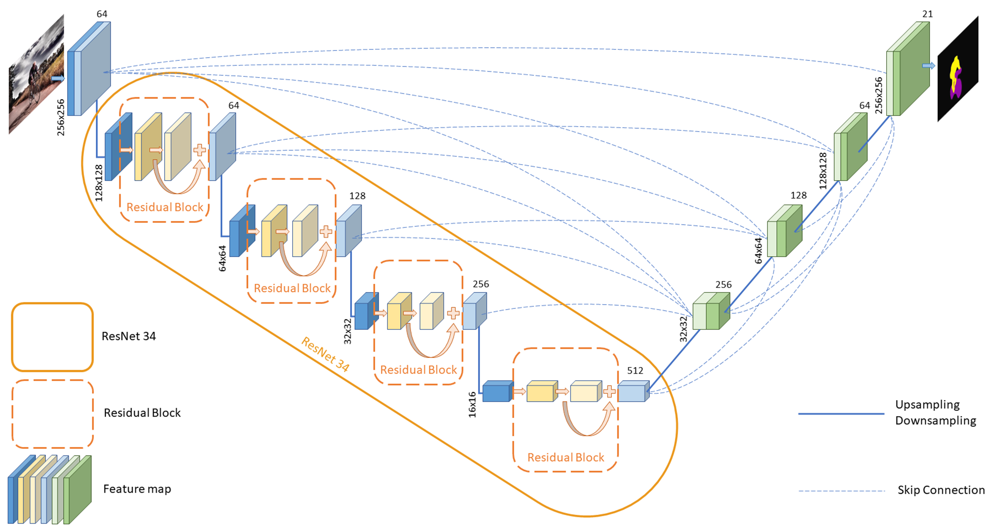
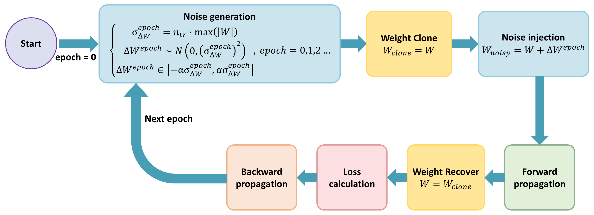
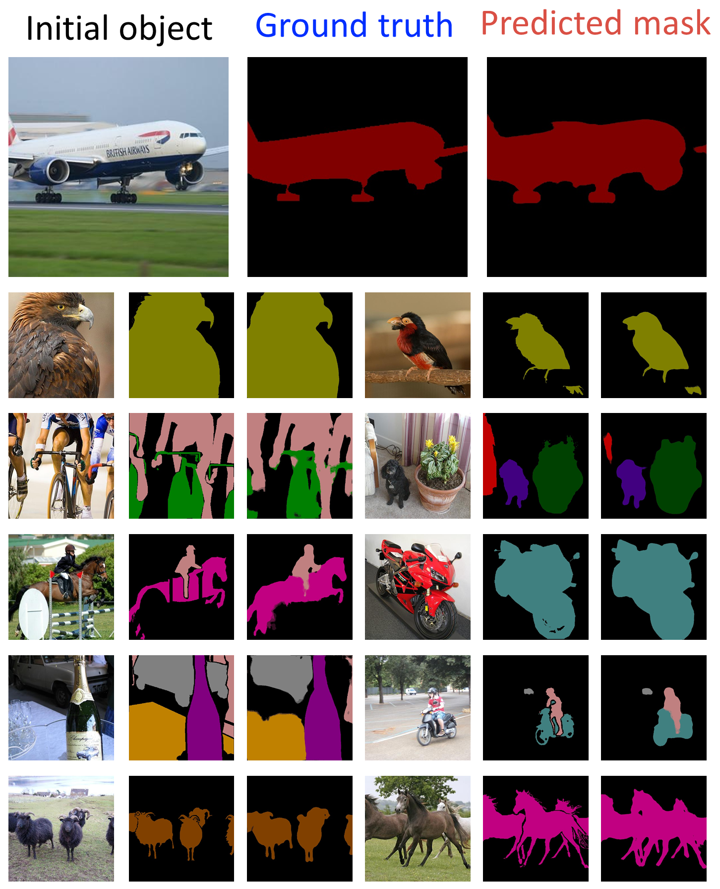
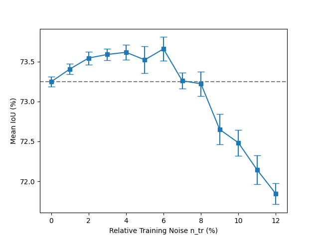
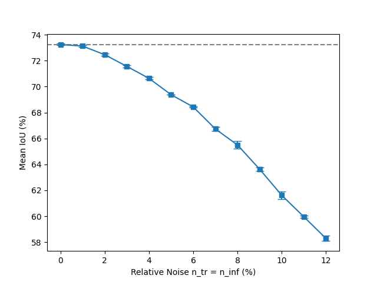

## Introduction

Advancing artificial intelligence (AI) technologies necessitates a comprehensive understanding and simulation of the operational principles of physical systems.
Such an understanding is essential for developing **robust and adaptable models** capable of maintaining performance under real-world imperfections.
Recent studies have demonstrated that perturbing neural network models can effectively simulate the behavior of physical components under various conditions, providing valuable insights into model resilience.

In this work, we explore the application of **perturbation-based techniques** to enhance the robustness of deep learning models in semantic segmentation tasks.
By introducing controlled perturbations during both training and inference, we aim to simulate real-world variances and assess the model's ability to maintain accuracy under noisy conditions.
This approach is particularly important for building AI systems that must operate reliably despite data imperfections and environmental uncertainties.

## Methodology

We adopted the **UNet3+** architecture to perform image semantic segmentation, leveraging its **full-scale skip connection** design to integrate semantic information and spatial features across multiple scales.
In this architecture, **ResNet34** serves as the encoder, providing a strong backbone for feature extraction.
This encoder-decoder structure allows the model to capture both high-level and low-level features effectively, enhancing its performance on complex segmentation tasks.



> _Image segmentation using UNet3+, a deep learning neural network with encoder-decoder architecture, in which ResNet34 plays a pivotal role as the encoder._

To evaluate and improve the robustness of the model under weight-level perturbations, we introduce a **three-stage perturbation training framework**, comprising the following steps:

1. **Weight Cloning** – Before injecting noise, the original weights of the model are cloned to ensure their recovery post-evaluation.
2. **Weight Noise Injection** – Controlled Gaussian noise is injected into the weights during forward propagation to simulate hardware-level noise or low-precision inference.
3. **Weight Recovery** – After the forward pass and loss computation, the original weights are restored to preserve the integrity of the training process during backpropagation.

The entire perturbation-aware training procedure is visualized in **the image below**.
At each epoch, noise is sampled from a Gaussian distribution whose standard deviation is proportional to the maximum absolute value of the original weights.
The perturbed weights are used only during the forward pass, after which the original weights are recovered for backpropagation.
This ensures that learning is guided by clean gradients, while the model is regularly exposed to perturbed conditions.



> _Flowchart of the weight perturbation strategy applied during training. Noise is generated based on a scaled Gaussian distribution and added to cloned weights. The original weights are recovered after forward propagation to enable stable gradient updates._

The noise generation process for each epoch is defined as:

$$
\begin{align*}
\sigma_{\Delta W}^{\text{epoch}} &= n_{\text{tr}} \cdot \max(|W|), \\
\Delta W^{\text{epoch}} &\sim \mathcal{N}\left(0, \left(\sigma_{\Delta W}^{\text{epoch}}\right)^2\right), \\
\Delta W^{\text{epoch}} &\in \left[-\alpha \sigma_{\Delta W}^{\text{epoch}}, \alpha \sigma_{\Delta W}^{\text{epoch}}\right]
\end{align*}
$$

This process ensures that the model is trained under varying but bounded perturbation conditions, ultimately encouraging robustness against weight-level noise encountered during real-world deployment scenarios.


### Weight Cloning

Prior to introducing noise, we clone the original model weights.
The cloning process saves a copy of the relevant layer's weights into a dictionary using their unique identifiers, allowing exact recovery after the perturbation phase.
This operation ensures that noise application remains non-destructive to model training.

```python
import torch.nn as nn

ORI_WEIGHT = {}

def weights_clone(m):
    classname = m.__class__.__name__
    if classname.find("Conv") != -1 or classname.find("Linear") != -1 or classname.find("BatchNorm") != -1:
        ORI_WEIGHT[id(m.weight)] = m.weight.data.clone()

def weight_clone(m):
    if isinstance(m, nn.Conv2d) or isinstance(m, nn.BatchNorm2d):
        weights_clone(m)
```


### Weight Noise Injection

During selected phases of training or inference, noise is injected into the cloned weights.
For each layer, the maximum absolute value across channels is calculated and scaled by a predefined factor.
Gaussian noise is sampled based on this scaled value and added to the weights.
The injected noise is further clipped to prevent excessively large perturbations.

```python
import torch
from config.config import cfg

def weights_add_noise(m):
    classname = m.__class__.__name__
    if classname.find("Conv") != -1 or classname.find("Linear") != -1 or classname.find("BatchNorm") != -1:
        channel_max_values = (
            cfg.model.n_tr * torch.max(torch.abs(m.weight.view(*m.weight.size()[:-2], -1)), dim=-1).values
        )
        sigma_delta_W_tr = channel_max_values.view(m.weight.size()[:-2] + (1,) * (len(m.weight.size()) - 2)).expand(m.weight.size())
        delta_Gij_l = torch.normal(mean=0.0, std=sigma_delta_W_tr)
        delta_Gij_l.clamp_(-cfg.model.alpha * sigma_delta_W_tr, cfg.model.alpha * sigma_delta_W_tr)
        m.weight.data += delta_Gij_l

def weight_add_noise(m):
    if isinstance(m, nn.Conv2d) or isinstance(m, nn.BatchNorm2d):
        weights_add_noise(m)
```


### Weight Recovery

Following the forward propagation under perturbed conditions, the original weights are restored from the saved clones.
This recovery step ensures that the model’s parameters are not permanently affected by the introduced noise, allowing consistent training behavior across epochs.

```python
from utils.weight_clone import ORI_WEIGHT

def weights_recover(m):
    classname = m.__class__.__name__
    if classname.find("Conv") != -1 or classname.find("Linear") != -1 or classname.find("BatchNorm") != -1:
        m.weight.data = ORI_WEIGHT[id(m.weight)]

def weight_recover(m):
    if isinstance(m, nn.Conv2d) or isinstance(m, nn.BatchNorm2d):
        weights_recover(m)
```


## Experimental Results

By following this methodology, the model's behavior under perturbations can be systematically evaluated without compromising the integrity of the learned parameters.



> _The segmentation result of UNet3+ on the Semantic Boundaries Dataset (SBD). The leftmost image displays the initial object, serving as the model's input. The middle and rightmost images show the actual object categories and the model's predicted outcomes, respectively._

The segmentation results on the **Semantic Boundaries Dataset (SBD)** confirm that the UNet3+ model, even when subjected to weight perturbations, is capable of **maintaining high segmentation accuracy**, thus validating the effectiveness of the proposed perturbation strategy.



> _The influence of injecting weight noise only during the training on network accuracy._



> _The influence of injecting weight noise during the training and inference on network accuracy._

## Discussion and Future Work

The demonstrated resilience of UNet3+ to weight perturbations suggests that perturbation-based techniques could be beneficially extended to **attention-based architectures**, where minor input variations often have significant impacts on model stability.
Enhancing the robustness of attention mechanisms could lead to improved performance in tasks requiring **fine-grained feature detection** and **sequence-to-sequence learning**, such as **machine translation**, **visual question answering**, and **multimodal learning**.

Building on this work, one promising research direction involves applying perturbation-based training to **pose estimation tasks**.
In pose estimation, models must accurately identify and track key body landmarks, often from **noisy, occluded, or low-resolution inputs**.
Incorporating noise during training could improve the resilience of pose estimation models, leading to **more stable landmark detection** even under challenging conditions such as partial visibility or poor lighting.

Another important avenue for future exploration is the extension of perturbation techniques to **Large Language Models (LLMs)**, including architectures such as **GPT** and **BERT**.
These models, though traditionally trained on clean text corpora, could benefit from **perturbation-enhanced training** to better handle **ambiguous or incomplete inputs**.
Introducing structured noise during training could increase the robustness of LLMs, making them **more resistant to adversarial examples** and **better suited for real-world deployments** where input data quality cannot always be guaranteed.

Furthermore, the integration of LLMs into **multimodal systems** combining vision and language underscores the need for stability across different modalities.
Applying perturbation strategies to both visual and language branches could strengthen the overall performance of multimodal systems, improving their effectiveness in tasks such as **image captioning**, **cross-modal retrieval**, and **video understanding**.

Finally, the role of **activation functions** in influencing model robustness under perturbations presents another exciting research opportunity.
Activation functions are critical in shaping neural network behavior, and investigating their interaction with noise could lead to the design of **new activation functions optimized for resilience**.
Such developments could enhance the generalization ability of models in both **visual recognition** and **natural language processing** tasks, paving the way for the next generation of **highly resilient AI systems**.


## Prepare Datasets

### Pascal VOC
Download [VOC2012](http://host.robots.ox.ac.uk/pascal/VOC/voc2012/VOCtrainval_11-May-2012.tar) and [trainaug](https://www.dropbox.com/s/oeu149j8qtbs1x0/SegmentationClassAug.zip?dl=0),
Extract trainaug labels (SegmentationClassAug) to the VOC2012 directory.
More info about trainaug can be found in [DeepLabV3Plus](https://github.com/VainF/DeepLabV3Plus-Pytorch/blob/master/README.md).

```
/data
    /VOCdevkit
        /VOC2012
            /SegmentationClass
            /SegmentationClassAug  # <= the trainaug labels
                2007_000032.png
                ...
            /JPEGImages
            ...
        ...
    /VOCtrainval_11-May-2012.tar
    ...
```


## Acknowledgement
* [UNet 3+: A Full-Scale Connected UNet for Medical Image Segmentation](https://arxiv.org/abs/2004.08790)
* VOC2012 data-pipeline and eval-metrics are modified from  [DeepLabV3Plus](https://github.com/VainF/DeepLabV3Plus-Pytorch)
